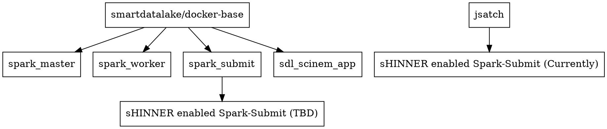

# Smart Data Lake SHinner-SciNeM Docker Stack # 

## Overview ##

WIP! 

This repository conslidates common services needed for selected SmartDataLake component, mainly focusing on an Hadoop enabled Spark deployment. 




## Preparation

- Get this repository
- Build the SciNem stack according to this [link](https://github.com/smartdatalake/docker-scinem)
- Build the Shinner according to this [link](https://github.com/smartdatalake/docker-shinner)

- ```./data/``` should contain sample data for the two repos
- ```./libs/``` should contain SciNeM dependencies (mainly the workflow)


## Usage

As the goal here is to enable the user to deploy the services that they actually need, on-demand, the docker-compose configruation has been split up accordingly:

- docker-compose.yaml - provide the core Spark services
- docker-compose-scinem.yaml - deploys SciNeM
- docker-compose-shinner.yaml - deploys SHinner

Hence, to deploy the full stack, run:

```docker-compose -f docker-compose.yaml -f docker-compose-scinem.yaml - f docker-compose-shinner.yaml up -d``` 

Or simply remove whatever service is not relevant.
